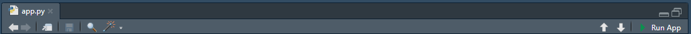

# 📚 Chat Interactivo con Carga de Archivos – Shiny para Python

Esta es una aplicación web tipo chat desarrollada con [Shiny para Python](https://shiny.posit.co/py/), que permite mantener conversaciones con un modelo de lenguaje (OpenAI) y cargar documentos PDF o imágenes para contextualizar las respuestas. Incluye autenticación básica, historial persistente de conversaciones, manejo de archivos y una interfaz interactiva adaptable.

## 🚀 Características

-   Iterfaz moderna tipo ChatGPT.

-   Historial persistente de chats por usuario.

-   Renombrar y eliminar conversaciones.

-   Scroll automático y animaciones.

-   Carga de archivos (PDF, PNG, JPG) para extraer contexto.

-   Integración con OpenAI GPT para generación de respuestas.

-   Configuración flexible vía archivos YAML (`paths.yaml`, `llm.yaml`).

-   Separación modular en funciones de configuración y utilidades.

## 🧩 Estructura del Proyecto

``` bash
project/
│
├── .env.template                  # API key de OpenAI
├── .gitignore
├── README.md
├── requierements.txt
├── renv.lock
└── src
    │
    ├── app.py                     # Código principal de la app
    ├── config/
    │   │
    │   ├── paths.yaml             # Rutas a recursos estáticos, estilos, logo, etc.
    │   └── llm.yaml               # Configuración del modelo LLM
    │
    ├── css/
    │    │
    │    └── styles.css            # Archivos de estilos
    │
    ├── db/
    │    │
    │    └── user_chats/
    │        │
    │        └── usuario_demo/     # Carpeta donde se almacenan los historiales por usuario
    │
    ├── utils/
    │   │
    │   ├── config_functions.py    # Carga y resolución de rutas desde YAML
    │   └── utils_functions.py     # Manejo de sesión, archivos, extracción de texto, etc.
    │
    ├── www/                       # Archivos estáticos (logo, otros)
    │   │
    │   └── my_logo.png            # Archivo del logo de la aplicación
    │
    └── data/                      # Carpeta donde se colocan los archivos .pdf, .jpg o .png que se usarían para extraer contexto
```

## 🧪 Requisitos

-   Python 3.9+
-   shiny
-   openai
-   python-dotenv
-   librerías auxiliares como `PyMuPDF` (para PDF), `pytesseract` (para OCR)

Instalación rápida:

``` bash
pip install -r requirements.txt
```

Si usas [`renv`](https://rstudio.github.io/renv/articles/python.html) puedes ejecutar el siguiente comando para instalar las librerías python desde el `requirements.txt`:

``` bash
renv::restore()
```

## ⚙️ Configuración

1.  Claves de API

    Cambia el nombre del archivo `.env.template` a `.env`, y luego pega tu clave de OpenAI:

``` env
# OpenAI (estandar)
OPENAI_API_KEY = 'sk-xxxxxxxxxxxxxxxxxxxxxxxxxxxxxxxxxxxxxxxx'
```

2.  Configuración de rutas (`paths.yaml`)

    Contenido:

``` yaml
# Data base path
data_base_folder_path: '../db/user_chats'

# Static assets path
statics:
    folder_path: '../www'
    logo_file_name: 'my_logo.png'

# Styles css file path
styles_file_path: '../css/styles.css'

# Tesseract path
tesseract_exe_path: 'C:/path/to/Tesseract-OCR/tesseract.exe'
```

En el archivo anterior, solo debes ajustar `logo_file_name` y `tesseract_exe_path` de acuerdo a tu caso.

3.  Configuración del modelo (`llm.yaml`)

    Contenido:

``` yaml
# Default LLM parameters
default_llm:
  model_name: 'gpt-4o'
```

Si quieres usar otros modelos de OpenAi, puedes cambiar el nombre del modelo modificando el valor de `model_name`.

## ▶️ Ejecución

Puedes lanzar la app ejecutando en la Terminal el siguiente comando:

``` bash
shiny run --reload app.py
```

Luego abre <http://localhost:8000> en tu navegador.

Adicionalmente, si estás usando RStudio, puedes ejecutar la app desde el botón **Run App**, y la aplicación se abrirá automáticamente en el navegador.



## 🧠 Flujo de Trabajo

1.  **Inicio**: Selecciona o crea un nuevo chat desde la barra lateral.

2.  **Conversación**: Escribe mensajes y el modelo responderá.

3.  **Carga de Archivos**: Adjunta un archivo PDF o imagen para extraer texto automáticamente.

4.  **Persistencia**: La conversación se guarda automáticamente.

5.  **Gestión de chats**: Puedes renombrar o eliminar cualquier conversación previa.

## 📎 Notas Técnicas

-   La carga de archivos usa `input_file` reactivo con control de versión.

-   Se utiliza un `MutationObserver` para hacer scroll automático al final del chat.

-   Los archivos anteriores se eliminan cuando se cambia de conversación o se inicia una nueva.

-   Las respuestas están limitadas a los últimos 10 mensajes para mantener el prompt eficiente.

-   El sistema agrega contexto del archivo como mensaje `system` solo si existe.

## 📌 To-Do / Futuras mejoras

-   🔐 Agregar sistema de login real (actualmente solo simulado con `session_data["authenticated"]`).
-    📊 Mostrar metadatos del archivo cargado.
-    🧩 Permitir búsqueda en chats antiguos.
-   🌐 Soporte para otros LLMs o despliegue local.

## 📝 Licencia

Este proyecto es de uso interno / académico / personal. Modifícalo libremente según tus necesidades.
